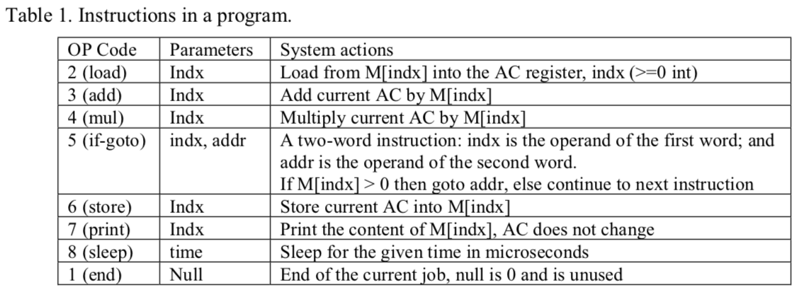
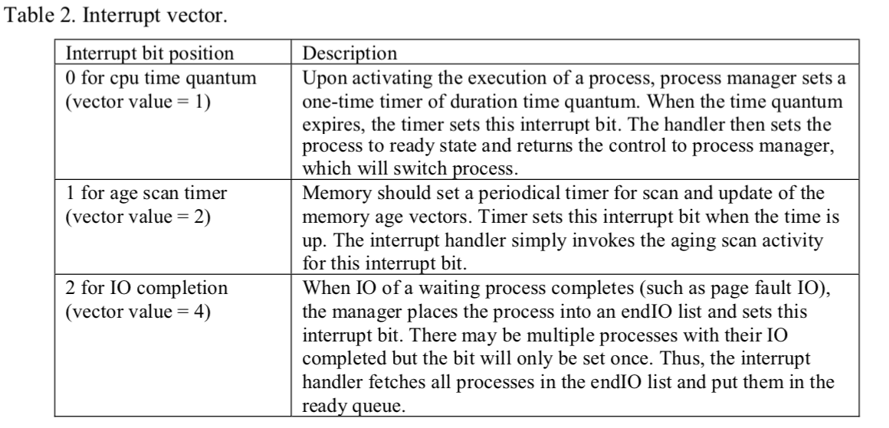

# simOS
Simulate a computer system and implement a simple Operating System that manages the resources of the computer system

## 1. Overview of a Simulated Simple OS
* The computer system has the following components: 
  * CPU (with registers)
  * memory
  * disk swap space
  * clock
* CPU drives the memory through *load* and *store* instructions, and other I/O devices (e.g., I/O for page fault).
  * These are simulated by software function calls.
* When system starts, the CPU executes the OS program
  * Loads in user programs upon submissions
  * Initiates CPU registers for a user program so that CPU executes it
  
### 1.1 Simulated Computer System
* CPU has a set of registers defined in *simos.h*
* CPU performs computation on these registers implemented by function *cpu_execution* in *cpu.c*
* Besides the *end-program* instruction, the corresponding datum for the instruction is fetched from memory and executed. 

* At the end of each instruction execution cycle, CPU checks the interrupt vector. 
  * If some interrupt bits are set, then the corresponding interrupt handling actions are performed by *handle_interrupt* in *cpu.c*.
  * 3 interrupt bits are defined in *simos.h*. The interrupt vector is initialized to 0. After completing interrupt handling, the interrupt vector is reset to 0. 
  
